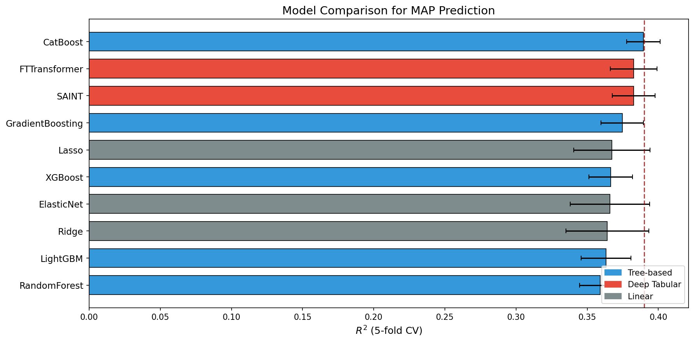
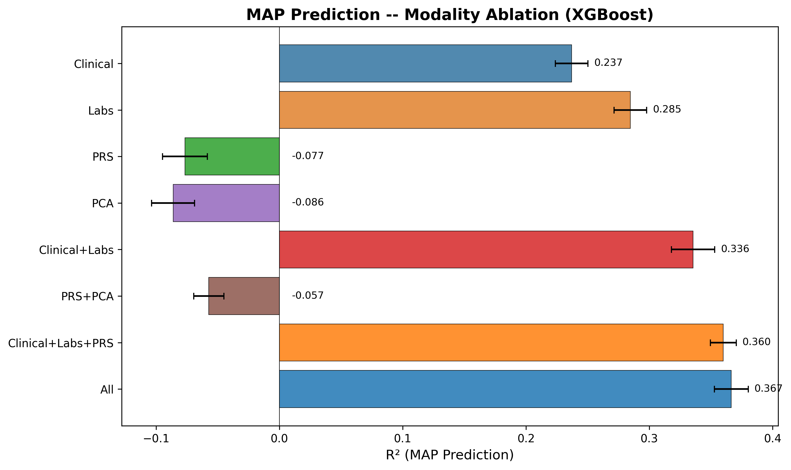
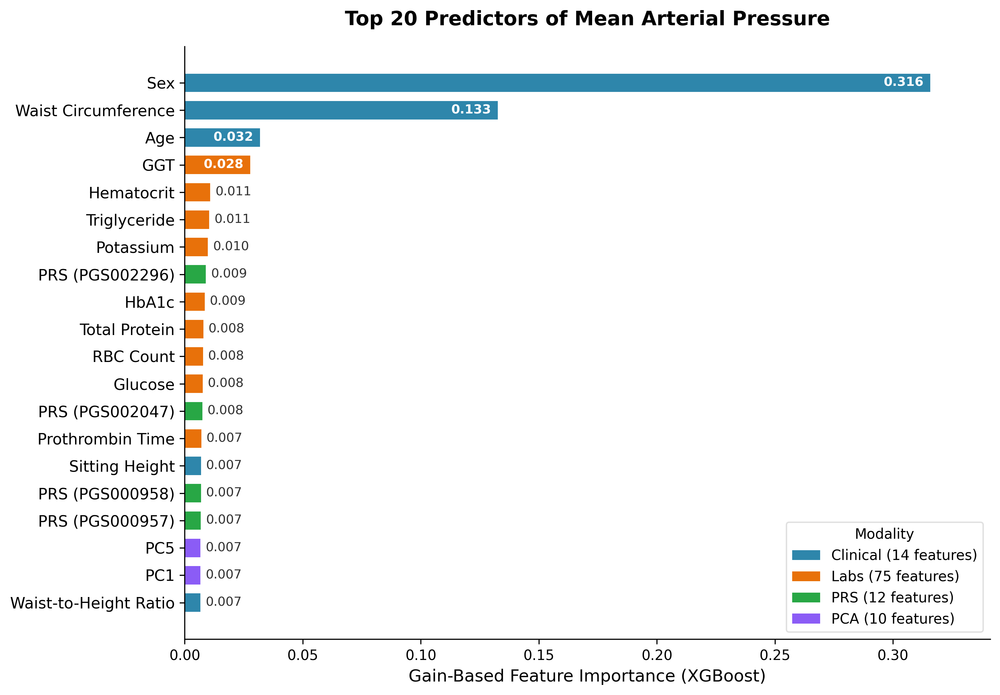
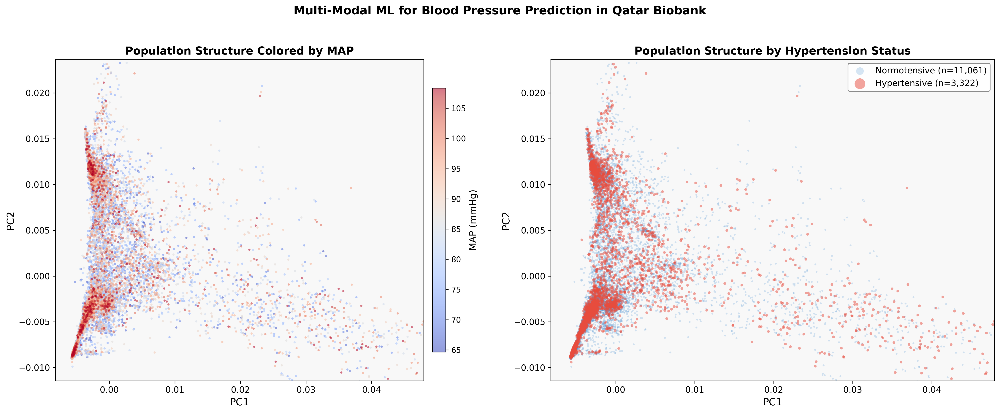

# Multi-Modal Machine Learning for Blood Pressure Prediction in Qatar Biobank

[](https://www.sciencedirect.com/journal/artificial-intelligence-in-medicine)
[](https://www.python.org/)
[](LICENSE)

This repository contains the code and results for the paper:

> **Multi-Modal Machine Learning for Blood Pressure Prediction in 14,383 Qatar Biobank Participants: Integrating Clinical, Laboratory, Polygenic Risk, and Population-Structure Data**
>
> Mohamed A. Mabrok, Rana Aldisi, Hatem Zayed
>
> *Submitted to Artificial Intelligence in Medicine*

---

## Overview

Hypertension is a leading modifiable risk factor for cardiovascular disease worldwide. This study evaluates whether integrating routine clinical measurements, standard laboratory biomarkers, polygenic risk scores (PRS), and population-structure (PCA) data can improve blood pressure prediction in a Middle Eastern population.

We analyzed **14,383 Qatar Biobank participants** using **111 features** across four data modalities and benchmarked **10 machine-learning models** spanning linear, tree-based, gradient-boosting, and deep tabular architectures.

### Key Findings

- **CatBoost** achieved the best overall performance: **R² = 0.389 ± 0.012**, RMSE = 8.50 mmHg, AUROC = 0.834 for hypertension classification.
- **SAINT** and **FT-Transformer** achieved comparable performance (R² = 0.383 each), with no statistically significant difference from CatBoost (p = 0.15 and p = 0.16, respectively).
- **Clinical features** (14 variables) and **laboratory biomarkers** (75 variables) provided the dominant predictive signal, accounting for 52.2% and 36.5% of total feature importance.
- **Polygenic risk scores** added a modest but consistent 2.4 percentage points of R² beyond clinical and laboratory features.
- A **performance ceiling** around R² ≈ 0.38–0.39 was observed, independent of model architecture, suggesting this represents the recoverable signal from routine clinical and genomic data.

---

## Repository Structure

```
.
├── README.md
├── LICENSE
├── requirements.txt
├── config/
│   ├── data_summary.json           # Dataset statistics (N, feature counts, missingness)
│   └── feature_groups.json         # Feature-to-modality mapping
├── scripts/
│   ├── 01_data_preparation.py      # Data loading, QC, feature grouping
│   ├── 02_full_ml_pipeline.py      # 10-model benchmark (5-fold CV) + SHAP importance
│   ├── 03_enhanced_pipeline.py     # Feature engineering + stacking ensemble
│   ├── 04_statistical_tests.py     # Pairwise model comparisons + confidence intervals
│   ├── 05_sensitivity_analysis.py  # MAP-threshold sensitivity for classification
│   ├── 06_deep_models_gpu.py       # FT-Transformer + SAINT (GPU implementation)
│   └── 07_regenerate_all_figures.py # Regenerate all publication figures
└── results/
    ├── tables/
    │   ├── fold_results_regression.tsv       # Per-fold R², RMSE, MAE for all 10 models
    │   ├── fold_results_classification.tsv   # Per-fold AUROC for classification
    │   ├── fold_results_ablation.tsv         # Per-fold ablation results (8 configurations)
    │   ├── model_comparison_regression.tsv   # Summary statistics for regression
    │   ├── model_comparison_classification.tsv # Summary statistics for classification
    │   ├── confidence_intervals.tsv          # 95% CIs for all models
    │   ├── statistical_tests_models.tsv      # Pairwise p-values (t-test, Wilcoxon, Bonferroni)
    │   ├── statistical_tests_ablation.tsv    # Ablation pairwise comparisons
    │   ├── statistical_tests_classification.tsv # Classification pairwise comparisons
    │   ├── ablation_regression.tsv           # Ablation summary (R², RMSE)
    │   ├── ablation_classification.tsv       # Ablation summary (AUROC)
    │   ├── shap_importance.tsv               # Gain-based feature importance (111 features)
    │   ├── cv_results.csv                    # Enhanced pipeline cross-validation results
    │   ├── enhanced_features.csv             # Engineered feature definitions
    │   ├── pipeline_summary.csv              # Baseline vs. enhanced vs. stacking summary
    │   └── sensitivity_map_thresholds.tsv    # Sensitivity analysis across MAP thresholds
    └── figures/
        ├── fig1_modality_ablation_r2.png     # Ablation analysis (R²)
        ├── fig2_modality_ablation_auroc.png  # Ablation analysis (AUROC)
        ├── fig3_model_comparison.png         # 10-model comparison bar chart
        ├── fig_shap_summary.png              # Top 20 feature importance (horizontal bar)
        ├── fig_shap_modality_pie.png         # Modality contribution (pie + bar)
        ├── fig6_predicted_vs_actual.png      # Predicted vs. actual MAP scatter
        ├── fig_sensitivity_thresholds.png    # Sensitivity analysis across thresholds
        ├── fig_statistical_significance.png  # Pairwise p-value heatmap
        ├── fig_pca_population_structure.png  # PCA population structure visualization
        └── shap_feature_importance.png       # Full SHAP importance bar chart
```

---

## Data Availability

The individual-level data used in this study are from the **Qatar Biobank (QBB)** and the **Qatar Genome Programme (QGP)**, managed by the **Qatar Precision Health Institute (QPHI)**. Due to participant privacy and institutional data governance policies, the raw data cannot be publicly shared.

**To request access:**
Qualified researchers may apply for data access through the Qatar Biobank at [https://www.qatarbiobank.org.qa](https://www.qatarbiobank.org.qa). Access is granted subject to institutional review and a data access agreement.

The `config/data_summary.json` file provides summary statistics about the dataset (sample size, feature counts, missingness rates, and outcome distributions) to support reproducibility assessment without individual-level data.

---

## Installation

### Requirements

- Python 3.8+
- CUDA-compatible GPU (for deep tabular models in script 06; CPU fallback available)

### Setup

```bash
# Clone the repository
git clone https://github.com/<your-username>/multimodal-bp-qatar.git
cd multimodal-bp-qatar

# Create a virtual environment (recommended)
python -m venv venv
source venv/bin/activate  # Linux/Mac
# venv\Scripts\activate   # Windows

# Install dependencies
pip install -r requirements.txt
```

---

## Reproducing the Results

The pipeline is designed to run sequentially. Each script reads outputs from the previous step.

### Step 1: Data Preparation
```bash
python scripts/01_data_preparation.py
```
Loads raw QBB data, applies quality-control filters, defines the four feature modalities (clinical, labs, PRS, PCA), excludes blood pressure-derived predictors, and saves the analytical dataset.

### Step 2: Full ML Pipeline (10 Models)
```bash
python scripts/02_full_ml_pipeline.py
```
Runs 5-fold cross-validation for all 10 models (Ridge, Lasso, ElasticNet, Random Forest, Gradient Boosting, XGBoost, LightGBM, CatBoost, FT-Transformer, SAINT) with within-fold median imputation. Performs modality ablation using XGBoost across 8 feature configurations. Computes gain-based feature importance.

### Step 3: Enhanced Pipeline
```bash
python scripts/03_enhanced_pipeline.py
```
Tests whether hand-crafted feature engineering (interaction terms, ratios, polynomial features) or a stacking ensemble can improve over the baseline 111-feature model.

### Step 4: Statistical Tests
```bash
python scripts/04_statistical_tests.py
```
Computes pairwise statistical comparisons (paired t-tests, Wilcoxon signed-rank tests) across all 45 model pairs, with Bonferroni correction. Generates 95% confidence intervals.

### Step 5: Sensitivity Analysis
```bash
python scripts/05_sensitivity_analysis.py
```
Evaluates hypertension classification performance across six MAP threshold definitions (93.3–110.0 mmHg) to assess robustness.

### Step 6: Deep Tabular Models (GPU)
```bash
python scripts/06_deep_models_gpu.py
```
Native PyTorch implementations of FT-Transformer and SAINT with per-feature tokenization, multi-head self-attention, cosine annealing, and early stopping. Requires GPU for practical training times.

### Step 7: Regenerate Figures
```bash
python scripts/07_regenerate_all_figures.py
```
Regenerates all publication-quality figures from the saved results tables.

---

## Model Hyperparameters

| Model | Key Hyperparameters |
|-------|-------------------|
| Ridge | α = 10 |
| Lasso | α = 0.01 |
| ElasticNet | α = 0.01, L1 ratio = 0.5 |
| Random Forest | 300 trees, max depth = 10 |
| Gradient Boosting | 300 trees, max depth = 5 |
| XGBoost | 500 trees, max depth = 6 |
| LightGBM | 500 trees, max depth = 6 |
| CatBoost | 500 iterations, max depth = 6 |
| FT-Transformer | d_model = 192, 8 heads, d_ff = 768, 3 layers, patience = 25 |
| SAINT | d_model = 192, 8 heads, d_ff = 768, 3 layers, patience = 25 |

All hyperparameters were fixed before cross-validation to prevent information leakage.

---

## Results Summary

### Regression Performance (Mean Arterial Pressure)

| Model | R² | ± SD | RMSE (mmHg) | 95% CI |
|-------|-----|------|-------------|--------|
| **CatBoost** | **0.389** | **0.012** | **8.50** | **[0.375, 0.404]** |
| SAINT | 0.383 | 0.015 | 8.55 | [0.364, 0.401] |
| FT-Transformer | 0.383 | 0.016 | 8.55 | [0.362, 0.403] |
| GradientBoosting | 0.375 | 0.015 | 8.60 | [0.356, 0.393] |
| XGBoost | 0.367 | 0.015 | 8.66 | [0.347, 0.386] |
| Ridge | 0.364 | 0.029 | 8.67 | [0.328, 0.400] |
| Lasso | 0.367 | 0.027 | 8.65 | [0.334, 0.401] |
| ElasticNet | 0.366 | 0.028 | 8.66 | [0.331, 0.401] |
| LightGBM | 0.363 | 0.018 | 8.68 | [0.341, 0.385] |
| RandomForest | 0.359 | 0.014 | 8.71 | [0.341, 0.377] |

### Modality Ablation (XGBoost)

| Modality | Features | R² | AUROC |
|----------|----------|-----|-------|
| Clinical | 14 | 0.237 | 0.780 |
| Laboratory | 75 | 0.285 | 0.790 |
| Clinical + Labs | 89 | 0.336 | 0.818 |
| Clinical + Labs + PRS | 101 | 0.360 | 0.825 |
| **Full model** | **111** | **0.367** | **0.830** |

---

## Feature Importance

The top 5 predictors of mean arterial pressure (XGBoost gain-based importance):

1. **Sex** (31.6%) — Clinical
2. **Waist circumference** (13.3%) — Clinical
3. **Age** (3.2%) — Clinical
4. **GGT** (2.8%) — Laboratory
5. **Hematocrit** (1.1%) — Laboratory

Clinical features contributed 52.2% and laboratory biomarkers 36.5% of total importance, while PRS and PCA contributed 6.5% and 4.8%, respectively.

---

## Figures

<p align="center">
  
  <br><em>Fig. 1. Cross-validated R² for all 10 models.</em>
</p>

<p align="center">
  
  <br><em>Fig. 2. Modality ablation analysis showing incremental contribution of each data layer.</em>
</p>

<p align="center">
  
  <br><em>Fig. 3. Top 20 predictors by gain-based feature importance.</em>
</p>

<p align="center">
  
  <br><em>Fig. 4. Population structure visualization (PC1 vs PC2) colored by MAP.</em>
</p>

---

## Citation

If you use this code or find our work useful, please cite:

```bibtex
@article{mabrok2026multimodal,
  title={Multi-Modal Machine Learning for Blood Pressure Prediction in 14,383 Qatar Biobank Participants: Integrating Clinical, Laboratory, Polygenic Risk, and Population-Structure Data},
  author={Mabrok, Mohamed A. and Aldisi, Rana and Zayed, Hatem},
  journal={Artificial Intelligence in Medicine},
  year={2026},
  note={Submitted}
}
```

---

## Authors

- **Mohamed A. Mabrok** — Department of Mathematics and Statistics, College of Arts and Sciences, Qatar University, Doha, Qatar
- **Rana Aldisi** — Department of Biomedical Sciences, College of Health Sciences, QU Health, Qatar University, Doha, Qatar
- **Hatem Zayed** (Corresponding author) — Department of Biomedical Sciences, College of Health Sciences, QU Health, Qatar University, Doha, Qatar. Email: hatem.zayed@qu.edu.qa

---

## License

This project is licensed under the MIT License — see the [LICENSE](LICENSE) file for details.

---

## Acknowledgments

This study was conducted using data from the Qatar Biobank and the Qatar Genome Programme, managed by the Qatar Precision Health Institute (QPHI). We thank all Qatar Biobank participants for their contributions.
